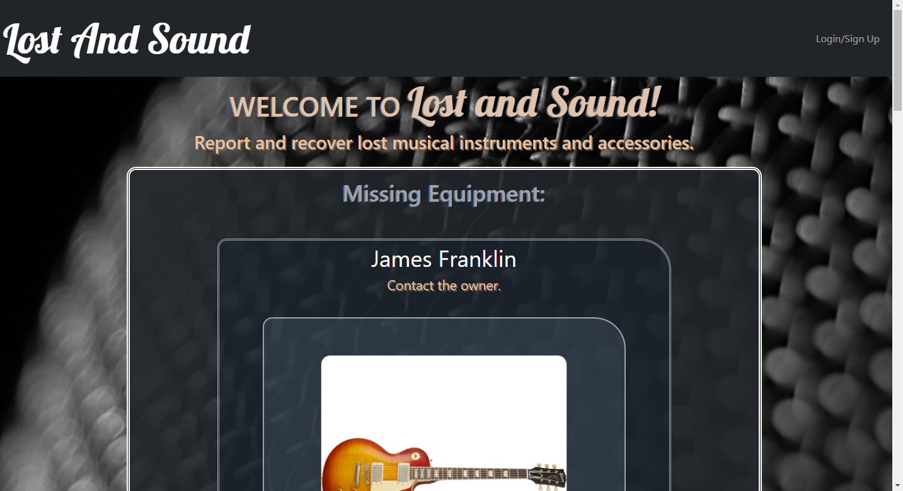

 
  # Lost and Sound
  

  ## Table of Contents
  * [Description](#description)
  * [Install](#install)
  * [Use](#use)
  * [License](#license)
  * [Contributing](#contributing)
  * [Tests](#tests)
  * [Questions](#questions)

  ## Description
  This MERN stack website allows users to create accounts and register equipment including the ability to map their location and upload pictures. Users have the ability to report their equipment as lost, which results in it being displayed publicly on the homepage where other users may contact them.

  ## Install
  Download the project files and run "npm install" to install the appropriate node packages. Using the "npm run develop" command will run both servers concurrently and produce the website at "http://localhost:3000/". 
  
  ## Use
     

  Deployed site: [Lost and Sound](https://lost-and-sound.herokuapp.com/)
  
  ## License
  Licensed under MIT License

  ## Contributing
  

  ## Tests
  No tests were created for this website.
  
  ## Questions
  - [Github for mattersievers](http://www.github.com/mattersievers)
  - For further questions, contact me through email at mattersievers@gmail.com

Here is nothing.